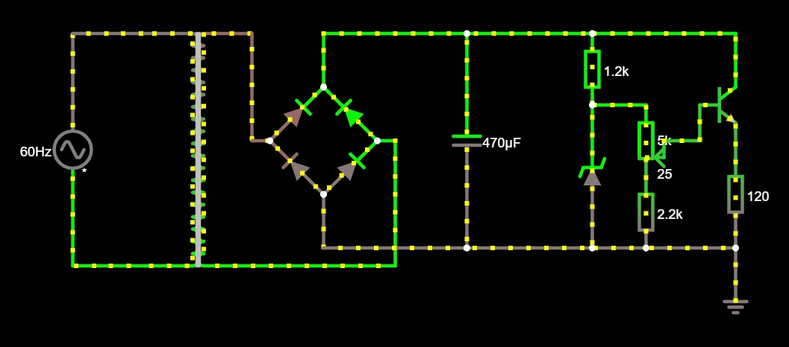

# Projeto Fonte Retificadora - SSC0180 Eletrônica 

> Clique [aqui](https://tinyurl.com/yfvuvstu) para acessar o circuito no falstad.

## Alunos:
*  **Matheus Giraldi Alvarenga** - 12543669
*  **Rafael Sartori Vantin** - 12543353
*  **Renato Tadeu Theodoro Junior** - 11796750
*  **Thierry de Souza Araújo** - 12681094

## Premissa:

Construir uma fonte reficadora que transforme uma corrente alternada (AC) de 127V e frequência 60Hz em corrente contínua (DC) com tensão ajustável entre 3V a 12V e com corrente igual à 100mA.

## Imagem do circuito:

## Componentes utilizados no projeto:

| Nome               | Quantidade | Valor Unidade | Valor R$ |
| ------------------ |-----------:| -------------:|---------:|
| Diodo              |          5 |        R$0,15 |   [R$0,75](https://www.baudaeletronica.com.br/diodo-1n4001.html?gclid=CjwKCAjwruSHBhAtEiwA_qCppsxkXFUC2Sy_gQdO0vh9f5p9KMD9ftG8ABoKyA15loVwlxWXfckyuBoCdT8QAvD_BwE) |
| Capacitor 470uF    |          1 |        R$0,45 |   [R$,0,45](https://www.baudaeletronica.com.br/capacitor-eletrolitico-470uf-25v.html) |
| Resistor 1.2kΩ     |          1 |        R$0,06 |   [R$0,06](https://www.baudaeletronica.com.br/resistor-1k2-5-1-4w.html?gclid=CjwKCAjwuvmHBhAxEiwAWAYj-JMxW1_w48xKTgLMsiLjybvp2md3GyukdLlqMQBGYN4TzrQlwvzL3RoCTYkQAvD_BwE) |
| Resistor 2.2kΩ     |          1 |        R$0,06 |   [R$0,06](https://www.baudaeletronica.com.br/resistor-2k2-5-1-4w.html?gclid=CjwKCAjwuvmHBhAxEiwAWAYj-HKgVRUoRfebU47qAxI0ci21BxgJWxEbIEHtERoLqJK7TPMF5tKNixoCJfcQAvD_BwE) |
| Potenciometro      |          1 |        R$2,21 |   [R$2,21](https://www.baudaeletronica.com.br/potenciometro-linear-de-5k-5000.html) |
| Diodo Zener (13V)  |          1 |        R$0,21 |   [R$0,21](https://www.baudaeletronica.com.br/diodo-zener-1n4743-13v-1w.html?gclid=CjwKCAjwuvmHBhAxEiwAWAYj-PsVqE9h-xFWbgh-humbM1tzDFbCvfsfjGAQCCMh2e5EPu7xwdN7ARoC6S0QAvD_BwE) |
| Transistor NPN     |          1 |        R$0,22 |   [R$0,22](https://www.baudaeletronica.com.br/transistor-npn-bc337.html) |
| Transformador      |          1 |        R$24,97|   [R$24,97](https://www.baudaeletronica.com.br/transformador-trafo-12v-12v-200ma-110-220vac.html) |

## Funcionamento de cada peça:

* **Transformador**: reduz a tensão.
 
* **Ponte de diodo**: transforma a corrente alternada em corrente contínua variável.  

* **Capacitor**: age como um reservatório, fornecendo corrente para a saída quando a tensão DC varia no retificar (suaviza a tensão).

* **Diodo Zener**: estipula uma tensão máxima, nesse caso 12V.

* **Resistores**: limita a corrente para o funcionamento correto do circuito.

* **Potenciometro**: torna possível variar a tensão de saída (entre 3V e 12V).

* **Transistor**: permite ajustar a passagem da corrente.

## Cálculos
  
   

   
Para um ripple de **10%**:   
   

 
 
 ### Correntes
    
   
   
   
 
 ### Capacitor
 
 
 
 Para obter um valor comercial utilizaremos um capacitor de:
 
 

## Esquemático EAGLE:

## Simulação EAGLE:

